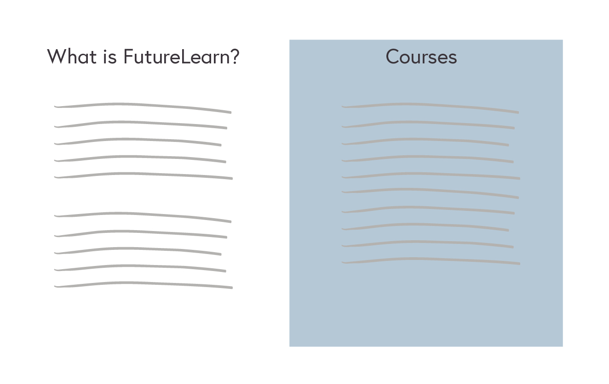
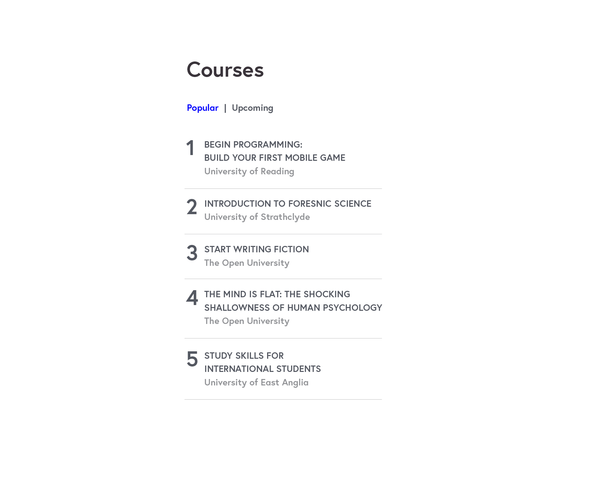

Front End Developer Exercise
============================

Please spend no more than 2 hours on this exercise. We do not need fully working examples, we will assess whatever you can achieve within this timeframe.

When completing this exercise, we'd like you to try and make it;

* Responsive
* Accessible
* Performant
* Scalable

* * *

As a learner on FutureLearn, I would like to easily switch between viewing 'Most Popular' and 'Upcoming' courses, in a small modular sidebar area on a page.

* * *

You should build a suitable page layout to accommodate this module in the sidebar, mobile first. In the mobile view, the module will wrap under main content and display at the bottom of the page. You are free to edit the markup as you see appropriate.

The mobile view is 600px and below.

The lists should be numbered and link to the relevant course detail page on the FutureLearn site. They tabs should then toggle to reveal each list.

This exercise should adhere to our [Browser Support matrix](https://about.futurelearn.com/browser-support/)

The look and feel of the module should match the visuals provided in the `visuals` folder, so the overall page should be roughly like this

And the module itself should look like this

Completion
---------------
To submit your work, please send it to <tech.jobs@futurelearn.com>.

